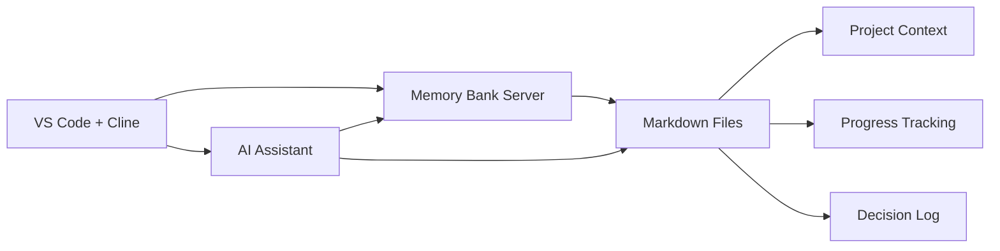
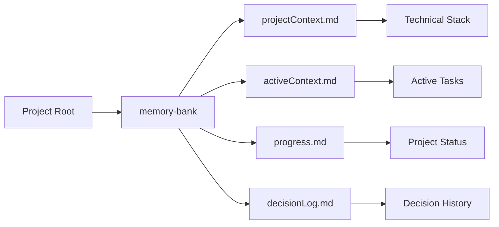
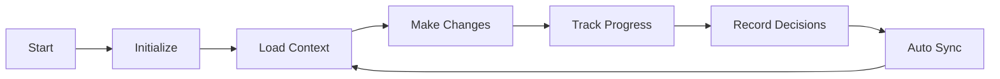

# Cline Memory Bank 

Inspired by [roo-code-memory-bank](https://github.com/GreatScottyMac/roo-code-memory-bank)

This project is **still in development** but is mostly working.

A Model Context Protocol server that provides persistent project context management for AI-assisted development - specifically designed to work with [Cline VSCode Extenson](https://marketplace.visualstudio.com/items?itemName=saoudrizwan.claude-dev).

## Table of Contents

- [Overview](#overview)
- [Installation](#installation)
  - [Prerequisites](#prerequisites)
  - [Setup Steps](#setup-steps)
- [Features](#features)
  - [Tools](#tools)
  - [Resources](#resources)
  - [System Prompt for Cline](#system-prompt-suggestion)
- [File Structure](#file-structure)
- [Using With Cline](#using-with-cline)
- [Development](#development)
- [Contributing](#contributing)
- [License](#license)

## Overview

The Memory Bank MCP server helps maintain consistent project context across development sessions by providing structured tools and resources for managing:

- Project context and technical details
- Current session state and tasks
- Progress tracking and milestones
- Technical decisions and rationale



## Persistent Memory System

One of the most powerful features of this project is its ability to maintain context across different coding sessions. Think of it as giving your AI assistant a "memory" that doesn't forget what you've been working on, even when you close VSCode and come back later.

### How It Works

Imagine you're working on a complex project that spans multiple days or weeks. Normally, each time you start a new coding session, you'd need to re-explain your project's context to the AI assistant. With the Memory Bank:


- Your AI assistant remembers previous discussions and decisions
- Maintains understanding of your project's architecture and goals
- Keeps track of ongoing tasks and progress
- Remembers your coding preferences and project conventions

### Key Benefits

1. **Continuity Across Sessions**
   - No need to re-explain your project every time
   - Pick up exactly where you left off
   - Maintains consistent understanding of your codebase

2. **Smart Context Management**
   - Automatically tracks important technical decisions
   - Records project progress and milestones
   - Maintains documentation of your development journey

3. **Enhanced Productivity**
   - Faster project onboarding for each session
   - More consistent and contextual AI assistance
   - Reduces repetitive explanations

4. **Project History**
   - Keeps track of why certain decisions were made
   - Maintains a log of completed features and changes
   - Helps new team members understand project evolution

The Memory Bank seamlessly integrates with the Cline VSCode Extension, requiring no additional setup from you once configured. It works quietly in the background, ensuring your AI assistant always has the context it needs to provide relevant and helpful assistance.

## Installation

### Prerequisites

- Node.js (v16 or later)
- VS Code with Cline extension installed
- TypeScript (for development)

### Setup Steps

1. Clone and build the server:
```bash
# Clone the repository
git clone https://github.com/dazeb/cline-mcp-memory-bank
cd cline-mcp-memory-bank

# Install dependencies
npm install

# Build the server
npm run build

# Make globally available (optional)
npm link
```

2. Configure Cline Extension:

Add the following to your Cline MCP settings (`~/.config/Code - Insiders/User/globalStorage/saoudrizwan.claude-dev/settings/cline_mcp_settings.json`):

```json
{
  "mcpServers": {
    "memory-bank": {
      "command": "node",
      "args": [
        "/path/to/cline-memory-bank/build/index.js"
      ],
      "disabled": false,
      "autoApprove": []
    }
  }
}
```

Replace `/path/to/cline-memory-bank` with the actual path to your server installation.

## Features

### Tools

Once installed simply ask cline to `initialize the memory bank`.

Then simply ask cline to update the memory bank or use `.clinerules` file or the system prompt.

1. `initialize_memory_bank`
   - Creates Memory Bank structure for a new project
   - Creates required markdown files with initial templates
   ```typescript
   use_mcp_tool('memory-bank', 'initialize_memory_bank', {
     projectPath: '/path/to/project'
   });
   ```

2. `update_context`
   - Updates active context with current session information
   - Tracks mode, tasks, and session state
   ```typescript
   use_mcp_tool('memory-bank', 'update_context', {
     projectPath: '/path/to/project',
     content: {
       currentSession: {
         date: '2025-03-13',
         mode: 'development',
         task: 'Implementing new feature'
       }
     }
   });
   ```

3. `record_decision`
   - Records technical decisions with rationale
   - Maintains history of architectural choices
   ```typescript
   use_mcp_tool('memory-bank', 'record_decision', {
     projectPath: '/path/to/project',
     decision: {
       title: 'Authentication System',
       description: 'Implementing JWT-based authentication',
       rationale: 'Better scalability and stateless operation',
       alternatives: [
         'Session-based auth',
         'OAuth only'
       ]
     }
   });
   ```

4. `track_progress`
   - Updates project progress and milestones
   - Manages task status and blockers
   ```typescript
   use_mcp_tool('memory-bank', 'track_progress', {
     projectPath: '/path/to/project',
     progress: {
       completed: ['Setup project', 'Initialize database'],
       inProgress: ['Implement auth', 'Create API routes'],
       blocked: ['Deploy to production']
     }
   });
   ```

### Resources

1. `memory://project/context`
   - Project overview and technical stack
   - Architecture principles and guidelines

2. `memory://active/context`
   - Current session state and tasks
   - Active considerations and notes

3. `memory://progress`
   - Project milestones and task tracking
   - Work status and blockers

4. `memory://decisions`
   - Technical decisions and rationale
   - Architecture choices and alternatives

### System Prompt Suggestion

Add to Cline system prompt or `.clinerules` file under settings.

```
Memory Bank Integration Rules:

CRITICAL: Before ANY task or response:
1. ALWAYS check active context (memory://active/context):
   - Current project state and mode
   - Ongoing tasks and their status
   - Recent decisions and updates
   - Open questions and concerns

2. ALWAYS review project context (memory://project/context):
   - Technical stack and dependencies
   - Project guidelines and standards
   - Architecture principles
   - Development workflow

3. ALWAYS consult decision log (memory://decisions) for:
   - Previous architectural choices
   - Established patterns
   - Technical rationales
   - Related decisions

4. ALWAYS check progress tracking (memory://progress):
   - Current phase and milestones
   - Completed work
   - In-progress tasks
   - Known blockers

After EVERY task:
1. Update active context with:
   - Task completion status
   - New information learned
   - Changes made

2. Record any technical decisions with:
   - Clear rationale
   - Considered alternatives
   - Impact assessment

3. Update progress tracking:
   - Mark completed items
   - Add new tasks identified
   - Note any blockers found

Key Guidelines:
- NEVER proceed without checking memory bank context
- ALWAYS maintain consistent project state
- Record ALL significant technical decisions
- Track progress in real-time
- Keep context updated with EVERY change
```
## File Structure

When initialized, the Memory Bank creates the following structure in your project:



### Initial File Contents

Upon initialization, each file is populated with structured content:

1. `activeContext.md`:
   - Current session information with timestamp
   - Initial tasks (Project initialization, Environment setup)
   - Open questions about project goals and requirements
   - Recent updates section

2. `progress.md`:
   - Current phase (Initialization)
   - Initial completed tasks (Repository setup, Basic structure)
   - In-progress tasks (Environment configuration, Documentation)
   - Upcoming tasks section
   - Blockers tracking

3. `decisionLog.md`:
   - Initial project structure decisions
   - Development workflow choices with alternatives
   - Documentation strategy decisions
   - Section for pending decisions

4. `projectContext.md`:
   - Project overview and version
   - Detected technical stack and dependencies
   - Configuration files listing
   - Architecture principles
   - Development setup instructions
   - Project workflow guidelines

## Using with Cline



Simply ask Cline to initialize the memory bank.  

1. Initialize a new Memory Bank:
   ```
   use_mcp_tool('memory-bank', 'initialize_memory_bank', {
     projectPath: process.cwd()  // or specific path
   });
   ```

2. Access project context:
   ```
   access_mcp_resource('memory-bank', 'memory://project/context');
   ```

3. Update session context:
   ```
   use_mcp_tool('memory-bank', 'update_context', {
     projectPath: process.cwd(),
     content: {
       currentSession: {
         date: new Date().toISOString().split('T')[0],
         mode: 'development',
         task: 'Current task description'
       }
     }
   });
   ```

4. Record technical decisions:
   ```
   use_mcp_tool('memory-bank', 'record_decision', {
     projectPath: process.cwd(),
     decision: {
       title: 'Decision Title',
       description: 'What was decided',
       rationale: 'Why it was decided'
     }
   });
   ```

## Development

To modify or enhance the server:

1. Update source in `src/index.ts`
2. Run tests: `npm test`
3. Build: `npm run build`
4. Restart Cline extension to load changes

## Contributing

Contributions are welcome! Please:

1. Fork the repository
2. Create a feature branch
3. Make your changes
4. Submit a pull request

## License

MIT © dazeb
